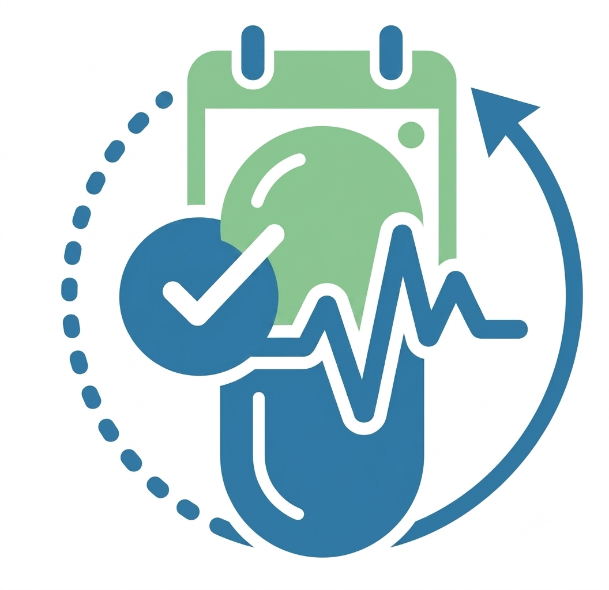

<div align="center">



# MedRemind

**Never miss a dose again.**

A smart, full-screen medicine reminder app for Android — built with Flutter, backed by an offline 21,000+ brand medicine database, and designed to keep ringing until you actually respond.

[](https://flutter.dev)
[](https://firebase.google.com)
[](#)
[](#)

</div>

---

## Screenshots

<!-- Add screenshot links below — replace each placeholder with the raw image URL once uploaded. -->

| Home | Medicine Cabinet | Medicine Info |
|---|---|---|
|  |  |  |

| Active Alarm | Schedules | Settings |
|---|---|---|
|  |  |  |

---

## Why MedRemind

Most reminder apps show a notification and hope for the best. MedRemind is built around one idea: **a missed dose should be hard to ignore, but easy to log.**

- A dose alarm doesn't just ping once — it **rings full-screen for a full minute**, and if you don't respond, it **auto-snoozes and re-rings up to 5 times** before finally logging the dose as skipped. You're always in control, but the app never quietly lets a reminder slip by unanswered.
- Every medicine you add is backed by a **21,000+ brand offline database** (Bangladesh medicine dataset) — so you get real drug info (why it's taken, its drug class, other brands with the same generic, dosage, side effects) without needing an internet connection.
- Subscription and account management is handled cleanly and independently — losing your login never touches your subscription, and vice versa.

## Features

### 🔔 Reminders & Alarms
- Full-screen ringing alarm (works even when the screen is off/locked) with swipe-up-to-dismiss
- Configurable per-dose-group schedule: time of day, meal relation (before/after meal), custom repeat days
- Automatic **ring → snooze (5 min) → re-ring** cycle, up to 5 times, before auto-marking a dose as skipped
- Manual **Dismiss (Taken)**, **Snooze**, and **Skip** actions
- Adjustable alarm sound (16+ built-in tones) with forced-volume ringing so it's always audible
- Toggleable Push Notifications and Ringing Alarm behavior from Settings

### 💊 Medicine Cabinet
- Add, edit, and remove medicines with smart brand-name autocomplete (backed by the offline dataset)
- Group-aware delete protection — can't accidentally delete a medicine that's still scheduled in a dose group
- Create, edit, and manage **Dose Groups**: bundle multiple medicines into a single scheduled reminder
- Pause/resume a dose group without deleting it

### 📖 Medicine Info
- Tap any medicine to see: why it's taken, its medicine group / drug class, other brands with the same generic, dosage guidance, side effects, and precautions — all served from a bundled offline dataset, no network required
- Gracefully shows "more details coming soon" for anything not yet in the dataset

### 🔍 Alternative Finder
- Search any brand name to instantly find its generic and every other brand that shares it

### 📅 Planner & History
- Calendar/agenda view of upcoming and past doses
- Daily and weekly adherence statistics (Taken / Skipped / Missed breakdown)

### 🔐 Auth & Subscription
- Mobile carrier-billing subscription gate (OTP-verified) — independent of your account
- Firebase Authentication: email/password and Google Sign-In, with password reset, password change, and account deletion
- Clean separation: logging out keeps your subscription active; unsubscribing signs you out entirely

### 🎨 Personalization
- 6 color palettes × light/dark mode = 12 theme combinations
- Responsive layout that adapts to different screen sizes and system font-scale settings

---

## Tech Stack

| Layer | Choice |
|---|---|
| Framework | Flutter (Dart) |
| State management | Riverpod |
| Navigation | go_router |
| Local database | sqflite (SQLite) |
| Local key-value storage | shared_preferences |
| Alarms | [`alarm`](https://pub.dev/packages/alarm) (native full-screen ringing) |
| Notifications | flutter_local_notifications |
| Auth | Firebase Authentication + Google Sign-In |
| Subscription | Custom OTP-based carrier-billing gate (HTTP) |
| Offline medicine data | Preprocessed Bangladesh medicine dataset (21k+ brands, 1.6k+ generics) |

See [`AUTH_AND_SUBSCRIPTION.md`](AUTH_AND_SUBSCRIPTION.md) for a full deep-dive into the auth and subscription architecture.

## Project Structure

```
lib/
  core/                 # Database, models, repositories, services, shared widgets/theme
  features/
    auth/                # Login, register, subscription, OTP verification
    home/                # Today's pills, quick actions
    medicine_cabinet/     # Add/edit medicines & dose groups, medicine info
    reminders/            # Full-screen active alarm screen
    calendar/              # Planner / agenda view
    history/                # Adherence statistics
    alternative_finder/      # Generic/brand search
    settings/                 # Profile, notifications & alarms, theme
    onboarding/                # Intro + permission requests
  main.dart                    # App entry point & auth/subscription flow gate
assets/
  audio/                       # Alarm ringtones
  icon/                        # App icon source
  med_dataset/                 # Preprocessed offline medicine database (JSON)
med_dataset/                   # Raw Kaggle CSV source + preprocessing script
```

## Getting Started

### Prerequisites
- Flutter SDK ≥ 3.4.0
- A Firebase project (Authentication enabled: Email/Password + Google)
- Android Studio / Xcode for platform builds

### Setup

```bash
git clone <this-repo>
cd med_remind_v2
flutter pub get
```

1. Run `flutterfire configure` (or manually place `google-services.json` / `GoogleService-Info.plist`) to wire up Firebase.
2. (Optional) Point the subscription backend at your own server:
   ```bash
   flutter run --dart-define=SERVER_BASE_URL=https://your-server.com/path
   ```
3. Run the app:
   ```bash
   flutter run
   ```

### Regenerating the offline medicine dataset

If you update the raw CSVs in `med_dataset/`, rebuild the compact JSON assets with:

```bash
cd med_dataset
python build_assets.py
```

### Regenerating the app icon

```bash
dart run flutter_launcher_icons
```

## License

Proprietary — all rights reserved.
